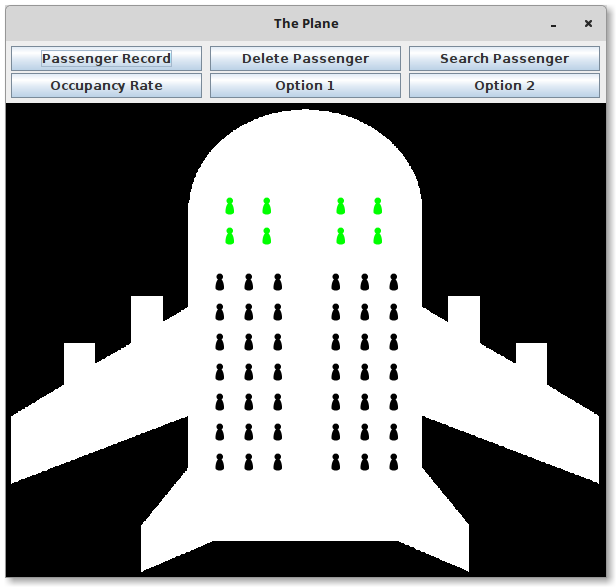

# Description

## Statement

An airline airplane has a fixed number of 50 seats. 8 of them are business class,
while the rest is economic class. Business seats are arranged in rows of four
separate seats int the middle of the corridor. Economic seats, however, are
arranged in six rows, three on each side of the corridor. The outline of the plane is:

    

When a passenger arrives to request a seat, he indicates his personal information
and preferences with respect to the seat position. Passenger information required
by the airline is the name and the identity card of the passenger which identify
him uniquely. To provide the desired location, the passenger indicates the class and
location, which may be, in case of business class, window and hallway and, in
case of economic class it can be window, center and hallway. The allocation of the
seat on the plane is on a first come, taking into account previous preferences. 